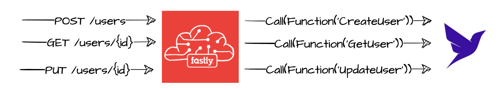

# Compute@Edge starter kit for JavaScript

From [Fastly starter kit](https://github.com/fastly/compute-starter-kit-javascript-default)

Example Compute @ Edge implementation of GET, PUT, POST /users:



## Setup
Edit `fastly.toml`. Only need to set `service_id`:
```
service_id = "<<service id>>"
```

Set environment variable `FASTLYP_API_TOKEN` to Personal API Token
```
export FASTLY_API_TOKEN=<<token>>
```

Install dependencies
```
npm install
```

Deploy
```
fastly compute deploy
```

